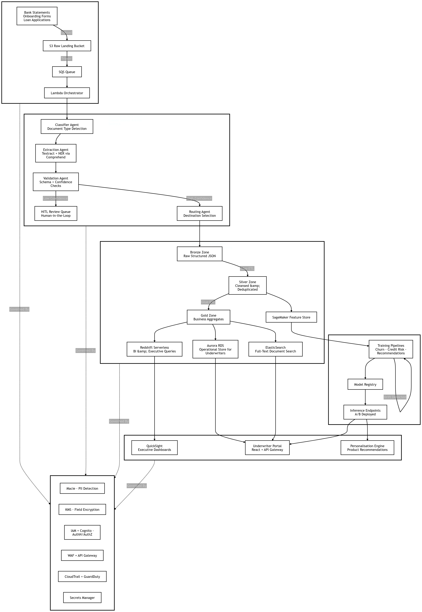

# Banking-Agent-Workflow

An n8n-based multi-agent workflow for automated ingestion, extraction, validation, and routing of financial documents (bank statements, onboarding forms, loan applications) on AWS.

---

## Table of Contents

1. [Architecture Overview](#architecture-overview)
2. [Pipeline Stages](#pipeline-stages)
3. [Prerequisites](#prerequisites)
4. [Environment Variables](#environment-variables)
5. [AWS Credentials Setup](#aws-credentials-setup)
6. [n8n Credential Configuration](#n8n-credential-configuration)
7. [Importing the Workflow](#importing-the-workflow)
8. [Security Layer](#security-layer)
9. [Data Zones](#data-zones)
10. [ML Pipeline](#ml-pipeline)
11. [Consumption Layer](#consumption-layer)
12. [Human-in-the-Loop (HITL)](#human-in-the-loop-hitl)
13. [Error Handling](#error-handling)
14. [Testing](#testing)
15. [Deployment Checklist](#deployment-checklist)

---

## Architecture Overview

```
Documents (Bank Statements / Onboarding Forms / Loan Applications)
    │
    ▼
S3 Raw Landing Bucket ──► SQS Queue ──► Lambda Orchestrator
                                               │
                          ┌────────────────────┼────────────────────┐
                          ▼                    ▼                    ▼
                  Classifier Agent    Extraction Agent      Validation Agent
                 (Bedrock / Claude)  (Textract + Comprehend) (Schema + Confidence)
                                                                     │
                                                           ┌─────────┴──────────┐
                                                           ▼                    ▼
                                                    HITL Review Queue    Routing Agent
                                                    (Human Approval)          │
                                                                              ▼
                                                                    Bronze → Silver → Gold
                                                                              │
                                             ┌────────────────────────────────┼────────────────────────┐
                                             ▼                                ▼                        ▼
                                    Aurora RDS                         Redshift Serverless      ElasticSearch
                                  (Underwriter Store)                  (BI / Executive)        (Full-Text Search)
                                             │                                │
                                             ▼                                ▼
                                    Underwriter Portal              QuickSight Dashboards
                                    (React + API Gateway)

                                    SageMaker Feature Store
                                             │
                                    ┌────────┴────────┐
                                    ▼                  ▼
                            Training Pipeline   Inference Endpoints (A/B)
                                                         │
                                                Personalisation Engine
```



---

## Pipeline Stages

### 1. Ingestion
| Node | Service | Purpose |
|---|---|---|
| Document Intake Webhook | n8n Webhook | HTTP entry point for document uploads |
| S3 Raw Landing Bucket | AWS S3 | Stores raw binary document with metadata tags |
| SQS Queue | AWS SQS | Decouples intake from processing; enables retry |
| Lambda Orchestrator | n8n Code | Parses SQS messages, prepares document context |

### 2. Agent Pipeline
| Node | Service | Purpose |
|---|---|---|
| Classifier Agent | Amazon Bedrock (Claude) | Detects document type with confidence score |
| Extraction Agent — Textract | AWS Textract | Extracts text, tables, and form fields |
| Extraction Agent — Comprehend NER | Amazon Comprehend | Identifies persons, orgs, dates, amounts |
| Validation Agent | n8n Code | Schema checks + confidence gate (threshold: 0.7) |
| HITL Router | n8n IF node | Routes to human review or auto-proceeds |

### 3. Data Zones
| Zone | Storage | Contents |
|---|---|---|
| Bronze | S3 | Raw structured JSON, no transformation |
| Silver | n8n Code | Cleansed, deduplicated (SHA-256 content hash) |
| Gold | n8n Code | Business aggregates, entity summaries, risk flags |

### 4. Consumption
| Node | Service | Consumers |
|---|---|---|
| Aurora RDS | PostgreSQL (Aurora Serverless) | Underwriter Portal |
| Redshift Serverless | Redshift | QuickSight BI dashboards |
| ElasticSearch | AWS OpenSearch / ES | Full-text document search |
| SageMaker Feature Store | SageMaker | ML training and inference |

---

## Prerequisites

- **n8n** self-hosted (v1.x or later) — running at `http://localhost:5678`
- **AWS account** with the following services enabled:
  - S3, SQS, Textract, Comprehend, Bedrock, KMS, Macie
  - Aurora Serverless (PostgreSQL-compatible), Redshift Serverless
  - OpenSearch / ElasticSearch, SageMaker, QuickSight
  - CloudTrail, GuardDuty, CloudWatch Logs, Secrets Manager
  - IAM + Cognito (for portal auth), WAF + API Gateway
- **Node.js** ≥ 18 (for n8n)
- **PostgreSQL client** accessible from n8n (for Aurora + Redshift nodes)

---

## Environment Variables

Set these in n8n under **Settings → Environment variables**:

```env
# S3 Buckets
S3_RAW_BUCKET=your-raw-landing-bucket
S3_BRONZE_BUCKET=your-bronze-zone-bucket
S3_GOLD_BUCKET=your-gold-zone-bucket

# SQS
SQS_QUEUE_URL=https://sqs.<region>.amazonaws.com/<account-id>/document-processing
HITL_QUEUE_URL=https://sqs.<region>.amazonaws.com/<account-id>/hitl-review

# AWS
AWS_REGION=ap-south-1
AWS_ACCOUNT_ID=123456789012

# Textract (async)
TEXTRACT_SNS_ARN=arn:aws:sns:<region>:<account-id>:textract-notifications
TEXTRACT_ROLE_ARN=arn:aws:iam::<account-id>:role/TextractServiceRole

# KMS
KMS_KEY_ID=arn:aws:kms:<region>:<account-id>:key/<key-id>

# SageMaker
SAGEMAKER_ROLE_ARN=arn:aws:iam::<account-id>:role/SageMakerExecutionRole
SAGEMAKER_FEATURE_STORE_ENDPOINT=https://featurestore-runtime.sagemaker.<region>.amazonaws.com
SAGEMAKER_ENDPOINT=https://runtime.sagemaker.<region>.amazonaws.com
SAGEMAKER_TRAINING_IMAGE=<ecr-uri>/<training-image>:<tag>
INFERENCE_ENDPOINT_NAME=financial-docs-inference
FEATURE_GROUP_NAME=financial-documents-fg

# QuickSight
QUICKSIGHT_DATASET_ID=your-dataset-id

# Portals
UNDERWRITER_PORTAL_URL=https://underwriter.yourdomain.com
UNDERWRITER_PORTAL_NOTIFY_URL=https://api.yourdomain.com/notify
PERSONALISATION_ENGINE_URL=https://api.yourdomain.com/personalisation
HITL_DASHBOARD_URL=https://hitl.yourdomain.com
```

---

## AWS Credentials Setup

Create an IAM user or role for n8n with the following policy actions:

```json
{
  "Version": "2012-10-17",
  "Statement": [
    {
      "Effect": "Allow",
      "Action": [
        "s3:PutObject", "s3:GetObject", "s3:ListBucket",
        "sqs:SendMessage", "sqs:ReceiveMessage", "sqs:DeleteMessage",
        "textract:StartDocumentAnalysis", "textract:GetDocumentAnalysis",
        "comprehend:DetectEntities", "comprehend:DetectPiiEntities",
        "bedrock:InvokeModel",
        "kms:Encrypt", "kms:Decrypt", "kms:GenerateDataKey",
        "sagemaker:PutRecord", "sagemaker:CreateTrainingJob", "sagemaker:InvokeEndpoint",
        "logs:CreateLogGroup", "logs:CreateLogStream", "logs:PutLogEvents",
        "quicksight:CreateIngestion"
      ],
      "Resource": "*"
    }
  ]
}
```

> For production, scope each action to specific resource ARNs.

---

## n8n Credential Configuration

After importing the workflow, configure these four credentials in n8n (**Settings → Credentials**):

| Credential ID | Type | Maps To |
|---|---|---|
| `aws-creds` | AWS | Main AWS account (S3, SQS, Textract, Bedrock, KMS, SageMaker) |
| `aurora-creds` | PostgreSQL | Aurora RDS cluster endpoint |
| `redshift-creds` | PostgreSQL | Redshift Serverless endpoint |
| `es-creds` | ElasticSearch | OpenSearch / ES cluster URL |

**Aurora RDS connection example:**
```
Host: your-cluster.cluster-xxxx.ap-south-1.rds.amazonaws.com
Port: 5432
Database: tradeos
User: tradeos_pipeline
Password: (from Secrets Manager)
SSL: required
```

---

## Importing the Workflow

### Method 1 — File import (recommended)
1. In n8n, open the workflow editor
2. Click **`...`** (top-right) → **Import from file**
3. Select `tradeos-document-pipeline.json`

### Method 2 — Clipboard paste
1. Open `tradeos-document-pipeline.json` in any text editor
2. Select all (`Ctrl+A`) and copy (`Ctrl+C`)
3. Click anywhere on the n8n canvas and press **`Ctrl+Shift+V`**

---

## Security Layer

The following security nodes run in parallel with the main pipeline:

| Component | AWS Service | Function |
|---|---|---|
| PII Detection | Amazon Macie / Comprehend | Scans extracted text; flags or redacts sensitive fields |
| Field Encryption | AWS KMS | Encrypts silver-zone payload before storage |
| Auth | IAM + Cognito | AuthN/AuthZ for portal access |
| WAF + API Gateway | AWS WAF | Protects all HTTP endpoints |
| Audit Logging | CloudTrail + GuardDuty | Writes processing events; enables compliance reporting |
| Secrets | AWS Secrets Manager | Stores DB passwords, API keys; no plaintext credentials in env |

> All processed documents are encrypted at rest (KMS) and in transit (TLS). PII detection runs before any data reaches Aurora, Redshift, or ElasticSearch.

---

## Data Zones

### Bronze Zone
- Storage: S3 (`S3_BRONZE_BUCKET`)
- Content: Raw JSON output from Textract + Comprehend, as-is
- No transformation applied

### Silver Zone
- Storage: n8n Code node (output written back to S3 and downstream)
- Transformations:
  - SHA-256 content hash for deduplication
  - Field normalisation
  - Entity list structuring

### Gold Zone
- Storage: Aurora RDS + Redshift + ElasticSearch
- Aggregations:
  - Entity summaries (persons, orgs, amounts, dates)
  - Risk indicators (`high_value_flag`, `multi_entity_flag`)
  - Business-ready fields for underwriter consumption

---

## ML Pipeline

### Feature Store
Documents reaching the Gold Zone write ML features to **SageMaker Feature Store** (`financial-documents-fg`). Features include:

- `document_type`
- `confidence`
- `entity_count`
- `high_value_flag`
- `event_time`

### Training Pipeline
Triggered from the Feature Store node. Runs a SageMaker training job for three model families:
- **Churn prediction** — identifies at-risk customers from onboarding patterns
- **Credit risk scoring** — derives risk score from loan application features
- **Product recommendations** — personalised product matching

Training jobs are typically scheduled weekly or triggered on data volume thresholds. Update `SAGEMAKER_TRAINING_IMAGE` with your ECR image URI.

### Inference Endpoints
Two endpoints are deployed in A/B configuration (`INFERENCE_ENDPOINT_NAME`). The pipeline invokes the active endpoint per document and forwards predictions to the **Personalisation Engine**.

---

## Consumption Layer

| Consumer | Source Data | Interface |
|---|---|---|
| QuickSight Executive Dashboards | Redshift Serverless | Auto-refreshed dataset |
| Underwriter Portal | Aurora RDS + ElasticSearch | React SPA via API Gateway |
| Personalisation Engine | SageMaker Inference | REST POST with prediction payload |

The Underwriter Portal receives a webhook notification for every processed document with a direct review URL:
```
https://underwriter.yourdomain.com/documents/<correlation_id>
```

---

## Human-in-the-Loop (HITL)

Documents are routed to the HITL queue when either condition is true:
- Classification confidence < 0.7
- Required schema fields are missing for the detected document type

### Review flow
1. Document context is sent to `HITL_QUEUE_URL` with a review URL
2. The n8n `Wait` node suspends execution (timeout: 72 hours)
3. A human reviewer approves or corrects via the HITL dashboard
4. The dashboard POSTs back to n8n's resume webhook URL
5. Pipeline continues from the **Routing Agent** with corrected data

### HITL webhook callback payload
```json
{
  "correlation_id": "...",
  "approved": true,
  "corrected_document_type": "BANK_STATEMENT",
  "corrected_confidence": 0.95,
  "reviewer_id": "user@domain.com"
}
```

Send this as a POST to the resume URL shown in the Wait node's settings.

---

## Error Handling

An **Error Trigger** node catches any pipeline failure and can be extended to:
- Write error details to CloudWatch Logs
- Send an alert to Slack / PagerDuty
- Requeue the document to SQS with a delay for retry

To add Slack alerting, connect a Slack node to the Error Trigger and set:
```
Channel: #tradeos-alerts
Message: Pipeline error — Correlation ID: {{ $json.correlationId }} — {{ $json.error.message }}
```

---

## Testing

### Trigger a test document
```bash
curl -X POST http://localhost:5678/webhook-test/document-intake \
  -H "Content-Type: application/json" \
  -d '{
    "filename": "test-bank-statement.pdf",
    "source": "api-test",
    "correlation_id": "test-001"
  }'
```

Expected response:
```json
{
  "status": "accepted",
  "correlation_id": "test-001",
  "message": "Document submitted for processing"
}
```

### Check execution logs
In n8n, go to **Executions** tab to inspect each node's input/output and identify any failures.

### Validate individual nodes
Click any node → **Execute node** to test it in isolation with mock data before running the full workflow.

---

## Deployment Checklist

- [ ] All environment variables set in n8n Settings
- [ ] `aws-creds` credential configured and tested
- [ ] `aurora-creds` credential configured (SSL enabled)
- [ ] `redshift-creds` credential configured
- [ ] `es-creds` credential configured
- [ ] S3 buckets created: raw, bronze, gold
- [ ] SQS queues created: document-processing, hitl-review
- [ ] Textract SNS topic and IAM role created
- [ ] KMS key created and ARN set
- [ ] SageMaker Feature Group `financial-documents-fg` created
- [ ] SageMaker inference endpoint deployed and named correctly
- [ ] Aurora schema initialised (`documents` table)
- [ ] Redshift schema initialised (`dw_documents` table)
- [ ] ElasticSearch index `financial-documents` created
- [ ] HITL dashboard deployed and resume webhook URL configured in Wait node
- [ ] Underwriter Portal API Gateway endpoint live
- [ ] Workflow **activated** via the toggle in the n8n editor top bar
- [ ] End-to-end test with a real document completed

---

## Project Structure

```
tradeos-document-pipeline/
├── tradeos-document-pipeline.json   # n8n workflow — import this
├── README.md                        # This file
└── schemas/
    ├── aurora_documents.sql         # Aurora RDS table definition
    ├── redshift_dw_documents.sql    # Redshift DW table definition
    └── elasticsearch_mapping.json   # ES index mapping
```

---

## License

Internal use only — TradeOS / ExportAgent project.
